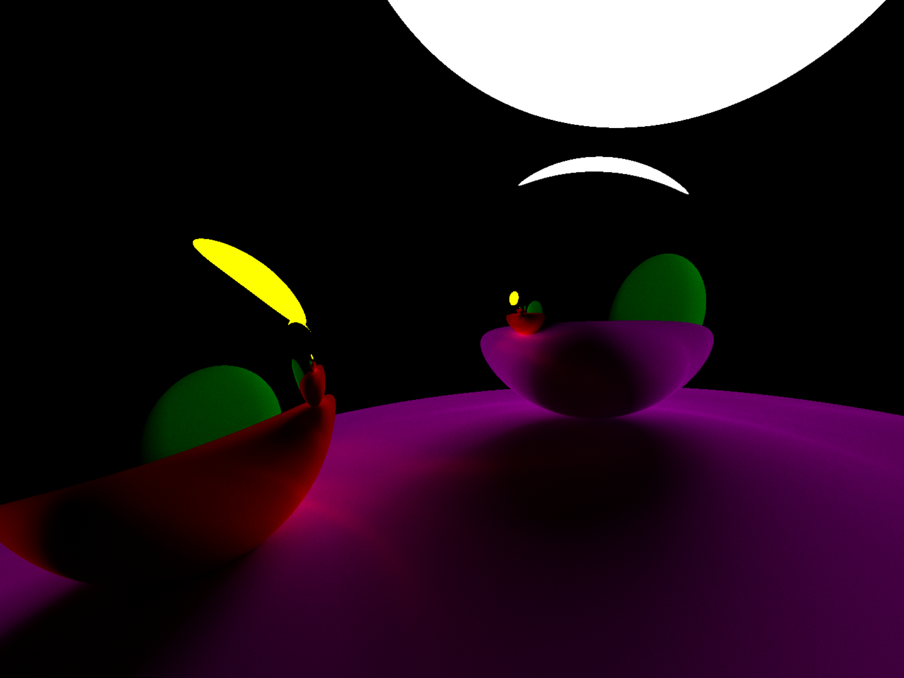

# 3D-Raytracer

_A simple cross-platform C++ 3D Raytracer using OpenGL_

## Screenshots

  

## Prerequisites 📝

- [A C++ Compiler](https://code.visualstudio.com/docs/languages/cpp#_install-a-compiler)
- [CMake](https://cmake.org)
- [vcpkg](https://vcpkg.io/en)
- [Ninja](https://ninja-build.org/) (Or another build system, just switch up the configure cmd.)
- [OpenGL 4.3+](https://www.opengl.org/)

## Building 🔨

1. Clone the repo:
   - `git clone https://github.com/msnba/3d-renderer.git`
2. CD into the new directory:
   - `cd ./3d-renderer`
3. Get the cmake toolchain file path for vcpkg:
   - `vcpkg integrate install`
4. Configure project with CMake (automatically installs dependencies):
   - `cmake -Bbuild -DCMAKE_TOOLCHAIN_FILE=/path/to/vcpkg/scripts/buildsystems/vcpkg.cmake -G "Ninja"`
   - There may be packages missing in order to compile the dependencies listed in the output, so also install those.
5. Build the project with CMake:
   - `cmake --build build`

## License

**[MIT](https://choosealicense.com/licenses/mit/)**
