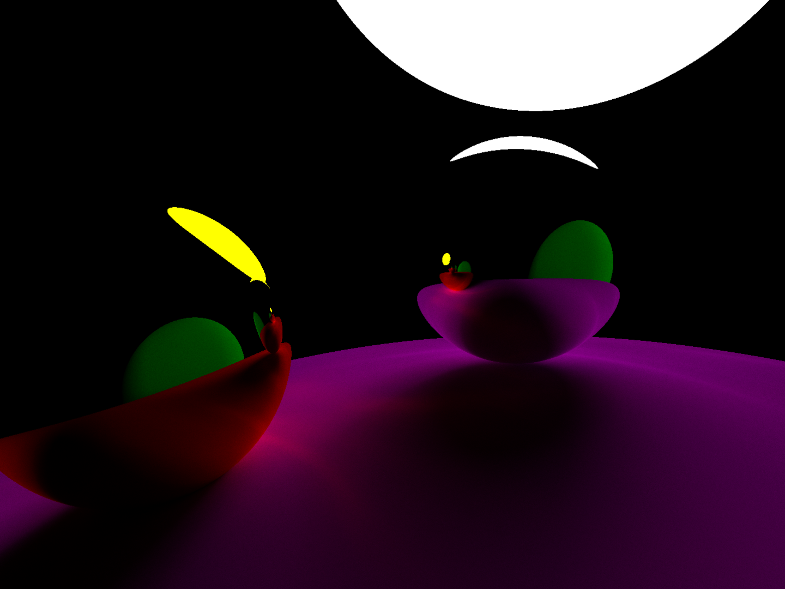

# 3D-Raytracer

_A simple cross-platform C++ 3D Raytracer using OpenGL_


## Screenshots

<p align="center">
  
  
</p>
<p align="center">
  
</p>

## Features ✅

- Real-time Monte Carlo path tracing.
- Ability to load .obj model files.
- Accumulates frames over time for a more realistic picture.
- Helpful user interface.
___
## Prerequisites 📝

- [A C++ Compiler](https://code.visualstudio.com/docs/languages/cpp#_install-a-compiler)
- [CMake](https://cmake.org)
- [vcpkg](https://vcpkg.io/en)
- [Ninja](https://ninja-build.org/)
- [OpenGL 4.3+](https://www.opengl.org/)

### Linux (Fedora)
```bash
sudo dnf install cmake ninja-build gcc gcc-c++ \
                 libX11-devel libXrandr-devel libXinerama-devel \
                 libXcursor-devel libXi-devel
```

### Linux (Ubuntu / Debian)
```bash
sudo apt install cmake ninja-build build-essential \
                 libx11-dev libxrandr-dev libxinerama-dev \
                 libxcursor-dev libxi-dev
```

### Windows (Visual Studio)
- [Visual Studio Build Tools](https://visualstudio.microsoft.com/downloads/) (at the bottom of the page in the *Tools for Visual Studio* section).
- Make sure to include vcpkg and CMake (Ninja is included).

___
## Building 🔨

### 1. Set up vcpkg (Linux only)
```bash
git clone https://github.com/microsoft/vcpkg.git
cd vcpkg
```
- `./bootstrap-vcpkg.sh`
- Add this to your ~/.bashrc or ~/.zshrc: `export VCPKG_ROOT=/path/to/vcpkg`

### 2. Clone and build
- On Windows, use the Developer Command Prompt.
```bash
git clone https://github.com/msnba/3d-renderer.git
cd 3d-renderer
vcpkg integrate install
cmake -B build -DCMAKE_TOOLCHAIN_FILE=/path/to/vcpkg.cmake
cmake --build build
```
- The binary is located in **`build/bin/engine`** or **`build/bin/Debug/engine.exe`** on Windows.
___
## License

**[MIT](https://choosealicense.com/licenses/mit/)**
